# Euler Oracle Dashboard

A comprehensive data pipeline for scraping, analyzing, and understanding the Euler Finance V2 oracle ecosystem on Ethereum.

## Overview

This project consists of seven main components:

1. **Web Scraper** - Extracts oracle data from Euler Finance's oracle directory
2. **Vendor Analyzer** - Categorizes and calculates market share of oracle providers
3. **Cross Oracle Analyzer** - Deep-dives into Cross oracles to identify their underlying oracle composition
4. **Vault-Vendor Analyzer** - Analyzes TVL (Total Value Locked) by oracle vendor across Euler vaults
5. **Governor Analyzer** - Identifies and analyzes vault governors (control addresses)
6. **Governor TVL Ranker** - Ranks governors by total TVL controlled
7. **Vault Filter** - Filters vault analysis by minimum TVL threshold

## Tech Stack

- **TypeScript** - Full type safety across the entire codebase
- **Bun** - Fast JavaScript runtime for better performance
- **ethers.js v6** - Ethereum library for blockchain interactions
- **Puppeteer** - Headless browser for web scraping
- **The Graph API** - Token balance data
- **DIA API** - Token price data
- **Etherscan API** - Contract verification and governor identification

## Project Structure

```
.
├── src/                             # TypeScript source files
│   ├── scrape-euler-oracles.ts      # Web scraper
│   ├── analyze-vendors.ts           # Vendor market share analyzer
│   ├── analyze-cross-oracles.ts     # Cross oracle composition analyzer
│   ├── analyze-vault-vendors.ts     # Vault TVL by vendor analyzer
│   ├── analyze-vault-governors.ts   # Governor identification analyzer
│   ├── rank-governors-by-tvl.ts     # Governor TVL ranking
│   ├── filter-vault-analysis.ts     # Vault TVL filter utility
│   └── aggregate-vendors.ts         # Shared vendor aggregation module
├── tsconfig.json                    # TypeScript configuration
├── package.json                     # Dependencies and scripts
├── .env.example                     # Environment variables template
└── *.json / *.csv                  # Output data files (generated)
```

## Data Pipeline Flow

```mermaid
flowchart TB
    %% External Data Sources
    Web[Euler Finance Website<br/>oracle directory]
    RPC[Ethereum RPC<br/>Factory Events]
    Graph[The Graph Token API<br/>Balance Data]
    DIA[DIA Price API<br/>Token Prices]
    Etherscan[Etherscan API<br/>Contract Info]

    %% Scripts
    S1[scrape-euler-oracles.ts]
    S2[analyze-vendors.ts]
    S3[analyze-cross-oracles.ts]
    S4[analyze-vault-vendors.ts]
    S5[analyze-vault-governors.ts]
    S6[rank-governors-by-tvl.ts]
    S7[filter-vault-analysis.ts]

    %% Terminal Output Titles
    T1["💬 Scraping Euler Oracles"]
    T2["💬 Vendor Market Share"]
    T3["💬 Cross Oracle Analysis"]
    T4["💬 Euler Vault-Vendor Analysis<br/>Vendor TVL Distribution"]
    T5["💬 Euler Vault Governor Analysis<br/>Governor Distribution"]
    T6["💬 📊 Governor TVL Ranking"]
    T7["💬 🔍 Vault Vendor Filter"]

    %% Main Output Files
    O1[(euler-oracles.json<br/>euler-oracles.csv)]
    O2[(vendor-analysis.json<br/>vendor-analysis.csv<br/>unknown-oracles.json/csv)]
    O3[(cross-oracle-analysis.json<br/>cross-oracle-analysis.csv)]
    O4[(vault-vendor-analysis.json<br/>vault-vendor-analysis.csv)]
    O5[(router-deployments.json<br/>vault-deployments.json)]
    O6[(vault-vendor-and-governor.json<br/>governor-analysis.json/csv)]
    O7[(governor-tvl-ranking.json<br/>governor-tvl-ranking.csv)]
    O8[(vault-vendor-analysis-filtered.json<br/>vault-vendor-analysis-filtered.csv)]

    %% Progress Files
    P1[scrape-progress.json]
    P2[cross-oracle-progress.json]
    P3[vault-vendor-progress.json]

    %% Flow with annotations
    Web --> S1
    S1 -.->|displays| T1
    S1 -->|All oracles| O1
    S1 -.-> P1

    O1 --> S2
    S2 -.->|displays| T2
    S2 -->|Categorizes vendors<br/>exports Unknown| O2

    O1 -->|Filter: provider='Cross'| S3
    RPC --> S3
    S3 -.->|displays| T3
    S3 --> O3
    S3 -.-> P2

    O1 --> S4
    O3 --> S4
    RPC -->|Factory events<br/>from START_BLOCK| S4
    Graph --> S4
    DIA --> S4
    S4 -.->|displays| T4
    S4 -->|⚠️ FILTER: excludes<br/>vaults with TVL=0<br/>67% excluded| O4
    S4 -->|Caches deployments| O5
    S4 -.-> P3

    P3 -->|All vault data| S5
    Etherscan --> S5
    S5 -.->|displays| T5
    S5 -->|⚠️ Skips: zero-address<br/>& non-compliant routers| O6

    O6 -->|⚠️ FILTER: only vaults<br/>with TVL>0| S6
    S6 -.->|displays| T6
    S6 --> O7

    O4 -->|Re-filters existing data| S7
    S7 -.->|displays| T7
    S7 -->|⚠️ FILTER: TVL ≥ $200k<br/>default threshold| O8

    %% Styling
    classDef scriptClass fill:#4A90E2,stroke:#2E5C8A,stroke-width:2px,color:#fff
    classDef dataClass fill:#50C878,stroke:#2D7A4A,stroke-width:2px,color:#fff
    classDef progressClass fill:#FFA500,stroke:#CC8400,stroke-width:2px,color:#fff
    classDef externalClass fill:#9370DB,stroke:#6A4FA3,stroke-width:2px,color:#fff
    classDef terminalClass fill:#FFD700,stroke:#DAA520,stroke-width:2px,color:#000

    class S1,S2,S3,S4,S5,S6,S7 scriptClass
    class O1,O2,O3,O4,O5,O6,O7,O8 dataClass
    class P1,P2,P3 progressClass
    class Web,RPC,Graph,DIA,Etherscan externalClass
    class T1,T2,T3,T4,T5,T6,T7 terminalClass
```



**Legend:**
- 🔵 **Blue boxes**: TypeScript scripts
- 🟡 **Gold boxes**: Terminal output titles (console display)
- 🟢 **Green cylinders**: Output data files (JSON/CSV)
- 🟠 **Orange boxes**: Progress files (auto-resume)
- 🟣 **Purple boxes**: External data sources
- **Solid arrows**: Main data flow
- **Dotted arrows**: Progress/state files and terminal displays

**Key Insights:**
1. **Linear Core Pipeline**: Steps 1-4 must run in sequence
2. **Parallel Analysis**: Steps 2-3 can run in parallel after step 1
3. **Governor Analysis Branch**: Steps 5-6 form a separate analysis chain
4. **Optional Filter**: Step 7 can run anytime after step 4
5. **Cached Data**: `router-deployments.json` and `vault-deployments.json` are reused across runs
6. **Progress Tracking**: Orange boxes enable resumable execution if interrupted

**⚠️ Important Filters (Annotated on Arrows):**
- **S3 (Cross Oracle Analyzer)**: Only processes oracles with `provider='Cross'`
- **S4 → O4 (Vault TVL Analysis)**: Excludes ~67% of vaults with TVL = $0 (empty vaults)
- **S5 → O6 (Governor Analysis)**: Skips vaults with zero-address routers (escrow vaults) and non-compliant routers
- **S6 (Governor Ranking)**: Inherits TVL>0 filter from input data
- **S7 → O8 (Vault Filter)**: Applies minimum TVL threshold (default: $200,000), excludes ~87% of funded vaults

## Installation

### Prerequisites

- [Bun](https://bun.sh) v1.0+ (install with `curl -fsSL https://bun.sh/install | bash`)

### Setup

```bash
# Install dependencies
bun install

# Optional: Create .env file for configuration
cp .env.example .env
```

## Pipeline Workflow

### 1. Scrape Oracle Data

Scrapes all oracle data from the Euler Finance oracle directory (29 pages, ~580 oracles).

```bash
bun run scrape
```

**Features:**

- Scrapes oracle provider, base/quote tokens, price, checks, and contract addresses
- Progress tracking - automatically resumes if interrupted
- Retry logic - attempts failed pages up to 3 times
- Headless browser detection avoidance

**Outputs:**

- `euler-oracles.json` - Complete oracle data in JSON format
- `euler-oracles.csv` - Spreadsheet-friendly CSV format
- `scrape-progress.json` - Progress tracking (auto-deleted on completion)

**What's captured:**

- Page number
- Provider name
- Base token
- Quote token
- Price
- Number of checks
- Contract address
- Etherscan link

---

### 2. Analyze Vendor Distribution

Analyzes the scraped data to calculate market share of different oracle providers.

```bash
bun run analyze
```

**Tracked Vendors:**

- Chainlink
- RedStone (includes RedStone Pull)
- Pyth
- Pendle
- Chronicle
- Midas
- MEV Capital
- Cross (wrapper - excluded from combined %)
- Fixed Rate
- Rate Provider
- Lido Fundamental
- Resolv
- Idle
- Other (uncategorized oracles)

**Outputs:**

- `vendor-analysis.json` - Detailed statistics and breakdowns
- `vendor-analysis.csv` - Market share table with direct, underlying, and combined percentages
- `unknown-oracles.json` - List of uncategorized oracles (if any)
- `unknown-oracles.csv` - Spreadsheet format of uncategorized oracles

**Features:**

- **Direct Usage**: Counts oracles used directly in the system
- **Underlying Usage**: Counts oracle providers used within Cross adapters
- **Combined %**: Total market share excluding Cross (which is a wrapper)
- **Uncategorized Tracking**: Automatically exports oracles that couldn't be categorized

**Example Output:**

```
--- Vendor Market Share ---
Total Valid Oracles: 580
Cross Oracles Analyzed: 148
Total Underlying Oracles: 296

Target Vendors:
  Vendor             Direct   Underlying  Total Combined %
  ----------------- ------   ----------- ------ -----------
  Chainlink         87 (15.00%)   124 (41.89%)    211      29.07%
  Pendle            94 (16.21%)    69 (23.31%)    163      22.45%
  Cross            150 (25.86%)     9 (3.04%)     159         N/A
  Pyth              89 (15.34%)    33 (11.15%)    122      16.80%
  ...

--- Uncategorized Oracles ---
Found 5 oracles that couldn't be categorized
Details saved to unknown-oracles.json
```

**Understanding the Metrics:**

1. **Direct Count**: Number of times this oracle vendor is used directly
2. **Direct %**: Percentage out of all direct oracles (580 total)
3. **Underlying Count**: Number of times used as underlying oracle in Cross adapters
4. **Underlying %**: Percentage out of all underlying oracle calls (296 total)
5. **Total Count**: Direct + Underlying
6. **Combined %**: Total share of actual oracle usage (Cross excluded from calculation)

**Why Cross Shows N/A:**

- Cross is a wrapper/adapter, not an actual oracle provider
- It's excluded from combined % to show true oracle provider market share
- The underlying oracles (Chainlink, Pyth, etc.) get the attribution instead

---

### 3. Analyze Cross Oracle Composition

Deep analysis of Cross oracles via RPC calls to identify their underlying oracle types.

```bash
bun run analyze-cross
```

**What it does:**
For each Cross oracle:

1. Calls `oracleBaseCross()` to get the first underlying oracle address
2. Calls `oracleCrossQuote()` to get the second underlying oracle address
3. Calls `name()` on each underlying oracle to identify its type
4. Stores the composition (e.g., "ChainlinkOracle + FixedRate")

**Features:**

- Rate limiting protection with automatic retries
- Progress tracking - resumes from where it stopped
- Exponential backoff for rate-limited requests
- Saves progress after each oracle analyzed
- Stops after 5 consecutive failures to prevent wasting time

**Outputs:**

- `cross-oracle-analysis.json` - Detailed composition of all Cross oracles
- `cross-oracle-analysis.csv` - Spreadsheet format
- `cross-oracle-progress.json` - Progress tracking (auto-deleted on completion)

**Example Output:**

```
--- Cross Oracle Analysis Summary ---
Total Cross Oracles: 150
Successfully Analyzed: 148
Failed: 2

--- Underlying Oracle Types ---
  ChainlinkOracle           89  (30.1%)
  FixedRate                 67  (22.6%)
  PythOracle                45  (15.2%)
  ...

--- Cross Oracle Composition Examples ---
  WETH/USD: ChainlinkOracle + FixedRate
  wstETH/USD: CrossOracle + ChainlinkOracle
  ...
```

---

### 4. Analyze Vault TVL by Oracle Vendor

Comprehensive analysis of Euler V2 vaults to calculate Total Value Locked (TVL) by oracle vendor.

```bash
bun run analyze-vaults
```

**What it does:**

This script performs a complete analysis in 4 steps:

1. **Discover Routers**: Queries Router Factory events to find all deployed routers
2. **Analyze Routers**: For each router, extracts oracle adapter configurations
3. **Discover Vaults**: Queries EVault Factory events to find all deployed vaults
4. **Calculate TVL**: Fetches vault balances and USD values, then aggregates by oracle vendor

**Data Sources:**

- **Blockchain (RPC)**: Factory events, router configs, vault data
- **The Graph Token API**: Vault token balances (amount, decimals, symbol)
- **DIA Price API**: Real-time token prices in USD
- **Local Cache**: Router/vault deployments, oracle data

**Features:**

- **Smart Caching**: Router/vault deployments cached in separate files
- **Incremental Sync**: Only queries new blocks since last run
- **Batch Processing**: Queries events in 10k block chunks to avoid rate limits
- **Recheck Logic**: Re-analyzes routers/vaults every N blocks (configurable)
- **Progress Tracking**: Resumes from where it stopped if interrupted
- **Fallback Pricing**: Uses stablecoin assumptions if price API fails

**Configuration:**

Required environment variables in `.env`:

```bash
# RPC endpoint
RPC_URL=https://eth.llamarpc.com

# Factory deployment blocks (REQUIRED)
ROUTER_FACTORY_START_BLOCK=20541273
EVAULT_FACTORY_START_BLOCK=20541273

# Recheck interval (optional, default: 50000 blocks ~7 days)
RECHECK_INTERVAL_BLOCKS=50000

# The Graph Token API JWT (REQUIRED for balance fetching)
GRAPH_TOKEN_JWT=your_jwt_token_here

# Etherscan API key (OPTIONAL, for governor contract name lookup)
ETHERSCAN_API_KEY=your_etherscan_api_key_here
```

**Outputs:**

- `vault-vendor-analysis.json` - Complete TVL breakdown by vendor
- `vault-vendor-analysis.csv` - Spreadsheet format
- `router-deployments.json` - Cached router addresses + deployment blocks
- `vault-deployments.json` - Cached vault addresses + deployment blocks
- `vault-vendor-progress.json` - Progress tracking (auto-deleted on completion)

**Example Output:**

```
=== Vault TVL Analysis by Oracle Vendor ===

Total TVL: $125,432,891.23
Total Vaults: 347

Vendor Breakdown:
  Chainlink          $52,341,223.45  (41.7%)  [142 vaults]
  Pyth              $31,245,678.90  (24.9%)   [87 vaults]
  Pendle            $22,134,567.12  (17.6%)   [64 vaults]
  RedStone          $12,456,789.34   (9.9%)   [32 vaults]
  Chronicle          $5,234,567.89   (4.2%)   [15 vaults]
  Other              $2,020,064.53   (1.6%)    [7 vaults]
```

**How it Works:**

1. **First Run**:

   - Queries all router/vault deployments from factory start block
   - Caches deployments to files for future runs
   - Processes all routers/vaults
   - Fetches balances from The Graph + prices from DIA
   - Saves checkpoint blocks

2. **Subsequent Runs**:

   - Loads cached deployments from files
   - Only queries factory for NEW deployments since last run
   - Skips routers/vaults processed recently (< RECHECK_INTERVAL)
   - Re-analyzes routers/vaults if enough blocks have passed
   - Incrementally updates TVL data

3. **Rate Limit Protection**:
   - Queries events in 10k block batches
   - 200ms delay between batches
   - Automatic retry with exponential backoff
   - Graceful fallback to RPC if APIs fail

**Smart Caching Logic:**

- **No lastFactoryBlock + cached deployments**: Only check last 10k blocks for new deployments
- **Has lastFactoryBlock**: Query from `lastBlock + 1` to current
- **First run ever**: Query from START_BLOCK to current

This minimizes RPC calls while keeping data fresh!

---

### 5. Analyze Vault Governors

Identifies the governor (control address) for each vault's oracle router and categorizes them.

```bash
bun run analyze-governors
```

**What it does:**

For each vault discovered in the previous step:

1. Retrieves the vault's oracle router address
2. Calls `governor()` on the router to get the controlling address
3. Uses Etherscan API to determine if the governor is an EOA or contract
4. If it's a contract, retrieves the contract name
5. Aggregates vault TVL by governor

**Features:**

- **Smart Caching**: Governors are looked up once and cached
- **Special Cases**:
  - Escrow vaults (zero address router) → "No Oracle Router (Escrow Vault)"
  - Non-compliant routers → "Oracle Router does not comply with interface"
  - EOA governors → "EOA"
  - Verified contracts → Shows actual contract name
- **Rate Limiting**: 250ms delay between Etherscan API calls (4 req/sec)
- **Vendor Aggregation**: Runs full vendor analysis with governor data

**Configuration:**

Optional environment variable in `.env`:

```bash
# Etherscan API key (optional, for contract name lookup)
ETHERSCAN_API_KEY=your_etherscan_api_key_here
```

- Without API key: Governors will be marked as "Unknown"
- With API key: Contract names and EOA detection available
- Free tier: 5 calls/second, 10,000 calls/day

**Outputs:**

- `vault-vendor-and-governor.json` - Enhanced vault data with governor information
- `vault-vendor-and-governor-analysis.json` - TVL breakdown by vendor (with governor data)
- `vault-vendor-and-governor-analysis.csv` - Spreadsheet format

**Example Output:**

```
=== Euler Vault Governor Analysis ===
Found 678 vaults to analyze

[1/678] Processing vault 0xD8b27CF359b7D15710a5BE299AF6e7Bf904984C2
  Router: 0x83B3b76873D36A28440cF53371dF404c42497136
  Governor: 0x35400831044167E9E2DE613d26515eeE37e30a1b
  Governor name: EulerGovernance

=== Summary ===
Total vaults: 678
Successfully processed: 675
Errors: 3
Unique governors found: 24

--- Governor Distribution ---
EulerGovernance                          423 (62.39%)
EOA                                       127 (18.73%)
Timelock                                   89 (13.12%)
No Oracle Router (Escrow Vault)            25 (3.69%)
Oracle Router does not comply...           14 (2.06%)
```

---

### 6. Rank Governors by TVL

Creates a ranking of governors by the total TVL they control.

```bash
bun run rank-governors
```

**What it does:**

1. Loads the governor-enhanced vault data
2. Groups vaults by governor address
3. Sums up TVL for each governor
4. Sorts by total TVL controlled
5. Shows top 20 governors

**Requirements:**

- Must run `bun run analyze-governors` first
- Requires `vault-vendor-and-governor.json` to exist

**Outputs:**

- `governor-tvl-ranking.json` - Full ranking of all governors
- `governor-tvl-ranking.csv` - Spreadsheet format

**Example Output:**

```
📊 Governor TVL Ranking Analysis
========================================================

Total TVL: $779,247,624.83
Total Governors: 24

Rank Governor Address                              Name                      TVL            % Total Vaults
========================================================
   1 0x35400831044167E9E2DE613d26515eeE37e30a1b  EulerGovernance       $485,234,567.89   62.28%    423
   2 0x1234567890abcdef1234567890abcdef12345678  Timelock              $123,456,789.12   15.84%     89
   3 0xabcdef1234567890abcdef1234567890abcdef12  EOA                    $87,654,321.09   11.25%    127
   ...

Top 20 Governors control: $756,123,456.78 (97.03% of total TVL)
```

**Use Cases:**

- Identify concentration of control in Euler ecosystem
- Audit governance decentralization
- Track which entities control the most TVL
- Monitor changes in governance over time

---

### 7. Filter Vaults by Minimum TVL

Filters the vault vendor analysis to only include vaults above a specified TVL threshold.

```bash
bun run filter-vaults
```

**What it does:**

1. Loads `vault-vendor-analysis.json`
2. Filters vaults with TVL > $200,000 (configurable)
3. Recalculates vendor distribution for filtered vaults
4. Shows how vendor share changes when excluding small vaults

**Configuration:**

Edit `MIN_VAULT_VALUE_USD` in `src/filter-vault-analysis.ts`:

```typescript
const MIN_VAULT_VALUE_USD = 200_000; // $200,000 minimum
```

**Outputs:**

- `vault-vendor-analysis-filtered.json` - Filtered analysis results
- `vault-vendor-analysis-filtered.csv` - Spreadsheet format

**Example Output:**

```
🔍 Vault Vendor Analysis Filter
==================================================
Minimum vault value: $200,000

📊 Total vaults in original dataset: 678
📊 Total TVL in original dataset: $779,247,624.83

📊 Unique vaults found: 678
✅ Vaults above $200,000: 89
❌ Filtered out: 589 vaults

📈 Vendor Distribution:
================================================================================
Vendor                TVL            TVL %   Vaults  Vault %
================================================================================
Chainlink         $425,123,456.78   54.57%      45   50.56%
Pyth              $198,765,432.10   25.51%      28   31.46%
Fixed Rate        $123,456,789.01   15.84%      12   13.48%
RedStone           $31,901,947.94    4.09%       4    4.49%
================================================================================
```

**Use Cases:**

- Focus on economically significant vaults
- Filter out dust/test vaults
- Analyze vendor distribution for production vaults
- Compare vendor share across different TVL tiers

---

## Complete Workflow

Run the entire pipeline:

```bash
# Step 1: Scrape oracle data
bun run scrape

# Step 2: Analyze vendor distribution
bun run analyze

# Step 3: Analyze Cross oracle composition
bun run analyze-cross

# Step 4: Analyze vault TVL by oracle vendor
bun run analyze-vaults

# Step 5: Analyze vault governors
bun run analyze-governors

# Step 6: Rank governors by TVL
bun run rank-governors

# Step 7 (Optional): Filter vaults by minimum TVL
bun run filter-vaults
```

## Output Files

| File                         | Description                                                    | Format |
| ---------------------------- | -------------------------------------------------------------- | ------ |
| `euler-oracles.json`         | Complete scraped oracle data                                   | JSON   |
| `euler-oracles.csv`          | Complete scraped oracle data                                   | CSV    |
| `vendor-analysis.json`       | Vendor market share with direct/underlying/combined stats      | JSON   |
| `vendor-analysis.csv`        | Vendor market share table (Direct %, Underlying %, Combined %) | CSV    |
| `cross-oracle-analysis.json` | Cross oracle composition details                               | JSON   |
| `cross-oracle-analysis.csv`  | Cross oracle composition table                                 | CSV    |
| `vault-vendor-analysis.json`                     | TVL breakdown by oracle vendor across all vaults                  | JSON   |
| `vault-vendor-analysis.csv`                      | TVL by vendor in spreadsheet format                               | CSV    |
| `vault-vendor-and-governor.json`                 | Vault data enhanced with governor information                     | JSON   |
| `vault-vendor-and-governor-analysis.json`        | TVL breakdown by vendor (with governor data)                      | JSON   |
| `vault-vendor-and-governor-analysis.csv`         | TVL by vendor with governors in spreadsheet format                | CSV    |
| `governor-tvl-ranking.json`                      | Ranking of governors by total TVL controlled                      | JSON   |
| `governor-tvl-ranking.csv`                       | Governor ranking in spreadsheet format                            | CSV    |
| `vault-vendor-analysis-filtered.json`            | Filtered vault analysis (TVL > threshold)                         | JSON   |
| `vault-vendor-analysis-filtered.csv`             | Filtered analysis in spreadsheet format                           | CSV    |
| `router-deployments.json`                        | Cached router addresses and deployment blocks                     | JSON   |
| `vault-deployments.json`                         | Cached vault addresses and deployment blocks                      | JSON   |
| `unknown-oracles.json`                           | Uncategorized oracles needing classification                      | JSON   |
| `unknown-oracles.csv`                            | Uncategorized oracles for review                                  | CSV    |

## Progress & Resume

All scripts support automatic resume:

**If scraping is interrupted:**

- Progress is saved in `scrape-progress.json`
- Run `bun run scrape` again to continue

**If Cross analysis hits rate limits:**

- Progress is saved in `cross-oracle-progress.json`
- Wait a few minutes
- Run `bun run analyze-cross` again to resume

**If vault-vendor analysis is interrupted:**

- Progress is saved in `vault-vendor-progress.json`
- Router/vault deployments cached in `router-deployments.json` and `vault-deployments.json`
- Run `bun run analyze-vaults` again to resume
- Script will skip already-processed routers/vaults

Progress files are automatically deleted when the task completes successfully. Deployment cache files are persistent and reused across runs.

## Incremental Sync & Recheck Logic

The vault-vendor analyzer implements smart incremental syncing to minimize RPC calls:

### First Run

1. Queries factory events from `ROUTER_FACTORY_START_BLOCK` to current block
2. Saves all discovered router/vault deployments to files
3. Processes each router/vault and stores `lastProcessedBlock = currentBlock`
4. Saves `lastRouterFactoryBlock` and `lastVaultFactoryBlock` in progress

### Subsequent Runs

1. **Factory Events**: Only queries NEW events from `lastFactoryBlock + 1` to current block
2. **Router/Vault Rechecks**: For each router/vault:
   - If `currentBlock - lastProcessedBlock < RECHECK_INTERVAL_BLOCKS`: **Skip**
   - If `currentBlock - lastProcessedBlock >= RECHECK_INTERVAL_BLOCKS`: **Re-query**
     - Routers: Query events from `lastProcessedBlock + 1` to `currentBlock`
     - Vaults: Re-fetch oracle/asset addresses (in case they changed)
     - Merge new data with existing data
     - Update `lastProcessedBlock = currentBlock`

### Benefits

- **Minimal RPC calls**: Only queries new blocks since last run
- **Always up-to-date**: New deployments are discovered automatically
- **Configurable freshness**: Adjust `RECHECK_INTERVAL_BLOCKS` for your needs
- **Smart caching**: Deployment lists cached in separate files

### Example Timeline

```
Block 1000: First run, process all routers, lastProcessedBlock[router1] = 1000
Block 1100: Second run, blocks since last = 100, RECHECK_INTERVAL = 50000, skip router1
Block 51000: Third run, blocks since last = 50000, RECHECK_INTERVAL = 50000, re-query router1
```

## Error Handling

### Scraping Errors

- Retries failed pages up to 3 times
- Saves progress before stopping
- Debug screenshots saved on failure

### Rate Limiting (Cross Analysis)

- Automatic detection of rate limit errors
- Exponential backoff: 5s → 10s → 15s → 20s → 25s
- Up to 5 retry attempts per request
- Stops after 5 consecutive failures
- Resume by running the script again

## Adding New Vendor Categories

When you run `bun run analyze`, uncategorized oracles are saved to `unknown-oracles.json/csv`. To add them to the analysis:

1. **Review uncategorized oracles:**

   ```bash
   cat unknown-oracles.json
   # or open unknown-oracles.csv in Excel/Sheets
   ```

2. **Add to vendor normalization:**
   Edit `analyze-vendors.js` and add to the `normalizeVendorName()` function:

   ```javascript
   if (providerLower.includes("newvendor")) return "NewVendor";
   ```

3. **Add to target vendors list:**
   Add the vendor to `TARGET_VENDORS` array at the top of `analyze-vendors.js`

4. **Re-run analysis:**
   ```bash
   bun run analyze
   ```

The newly categorized oracles will now appear in the vendor analysis with their market share!

## Configuration

### Environment Variables

Create a `.env` file in the project root to configure the pipeline:

```bash
# Copy the example file
cp .env.example .env
```

**Available Configuration:**

**RPC_URL** - Ethereum RPC endpoint (default: https://eth.llamarpc.com)

```bash
RPC_URL=https://mainnet.infura.io/v3/YOUR_KEY
```

**ROUTER_FACTORY_START_BLOCK** - ⚠️ **REQUIRED** - Starting block for Router Factory event queries

```bash
ROUTER_FACTORY_START_BLOCK=19400000
```

- **This is required** - the script will exit if not set
- Router Factory: `0x70B3f6F61b7Bf237DF04589DdAA842121072326A`
- Find deployment block on [Etherscan](https://etherscan.io/address/0x70B3f6F61b7Bf237DF04589DdAA842121072326A)

**EVAULT_FACTORY_START_BLOCK** - ⚠️ **REQUIRED** - Starting block for EVault Factory event queries

```bash
EVAULT_FACTORY_START_BLOCK=19400000
```

- **This is required** - the script will exit if not set
- EVault Factory: `0x29a56a1b8214D9Cf7c5561811750D5cBDb45CC8e`
- Find deployment block on [Etherscan](https://etherscan.io/address/0x29a56a1b8214D9Cf7c5561811750D5cBDb45CC8e)

**RECHECK_INTERVAL_BLOCKS** - How often to re-query routers/vaults for new events

```bash
RECHECK_INTERVAL_BLOCKS=50000
```

- Default: 50000 blocks (~7 days on Ethereum at 12s block time)
- Lower values = more frequent updates but more RPC calls
- Higher values = less frequent updates but fewer RPC calls
- Routers/vaults are only re-queried if `currentBlock - lastProcessedBlock >= RECHECK_INTERVAL_BLOCKS`

**Example .env file:**

```bash
RPC_URL=https://eth.llamarpc.com
ROUTER_FACTORY_START_BLOCK=19400000
EVAULT_FACTORY_START_BLOCK=19400000
RECHECK_INTERVAL_BLOCKS=50000
GRAPH_TOKEN_JWT=your_jwt_token_here
ETHERSCAN_API_KEY=your_etherscan_api_key_here
```

### Rate Limiting

Edit `analyze-cross-oracles.js` to adjust:

- `BASE_DELAY` - Delay between requests (default: 500ms)
- `RATE_LIMIT_DELAY` - Delay when rate limited (default: 5000ms)
- `MAX_RETRIES` - Max retries per oracle (default: 3)
- `MAX_CONSECUTIVE_FAILURES` - Stop after N failures (default: 5)

## Data Structure

### Oracle Entry

```json
{
  "page": 1,
  "provider": "Chainlink",
  "providerInfo": "Chainlink",
  "base": "WETH",
  "quote": "USD",
  "price": "$3,500.00",
  "checks": "(7)",
  "address": "0x1067...d84E1D",
  "addressLink": "https://etherscan.io/address/0x10674C8C1aE2072d4a75FE83f1E159425fd84E1D"
}
```

### Cross Oracle Analysis Entry

```json
{
  "crossAddress": "0x02dd...9528D7",
  "base": "wstETH",
  "quote": "USD",
  "page": 1,
  "baseCrossAddress": "0x1234...5678",
  "baseCrossName": "ChainlinkOracle",
  "crossQuoteAddress": "0xabcd...ef01",
  "crossQuoteName": "FixedRate",
  "resolvedNames": ["ChainlinkOracle", "FixedRate"]
}
```

## Requirements

- Bun 1.0+ (install: `curl -fsSL https://bun.sh/install | bash`)
- Ethereum RPC endpoint for analysis
- TypeScript 5.0+ (included in devDependencies)

## Troubleshooting

**Scraper timing out:**

- The site may be blocking headless browsers
- Check `debug-page-*.png` and `debug-page-*.html` for clues
- Try increasing timeouts in `scrape-euler-oracles.js`

**Cross analysis failing:**

- Check RPC endpoint is working
- Try using a different RPC (Infura, Alchemy, etc.)
- Reduce `BASE_DELAY` if using a rate-limited RPC

**Out of memory:**

- Reduce batch sizes
- Process data in chunks
- Use streaming for large files

## License

MIT

## Contributing

Pull requests welcome! Please ensure all scripts maintain:

- Progress tracking and resume functionality
- Proper error handling
- Clear console output
- CSV + JSON output formats
